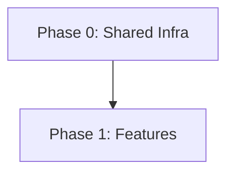

# Strategy Report: [Focus Area]

## Executive Summary
[3-5 sentences summarizing the strategy]

## Strategy Matrix
| Gap | Research Finding | Approach | Phase | Hours | Dependencies |
| :--- | :--- | :--- | :--- | :--- | :--- |
| | | | | | |

## Dependency Graph

## Contract Changes
- [File Name]: [Type/Field Update]

## Build Order
1. [Step 1]
2. [Step 2]

## Total Hours
[Estimate] / 40h
