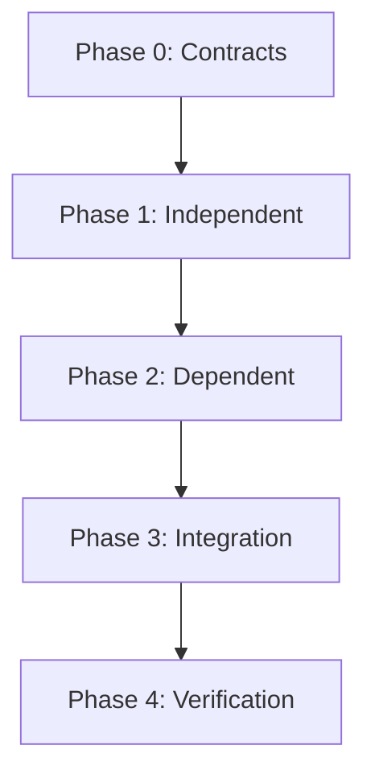

# Build Strategy — YYYY-MM-DD

## Executive Summary
<!-- 3-5 sentences: what the research revealed, biggest opportunity, recommended approach -->

## Strategy Matrix

| # | Gap | Research Finding | Approach | Phase | Hours | Dependencies |
|---|-----|-----------------|----------|-------|-------|-------------|
| 1 | | | | | | |

## Dependency Graph

## Contract Changes Required

| Contract File | Change | Reason |
|--------------|--------|--------|
| | | |

## Build Order

### Phase 0 — Foundation (Sequential)
1. **[Item]** — [Hours] — [What changes]

### Phase 1 — Independent (Parallel)
- **[Item]** — [Hours] — [What changes]

### Phase 2 — Dependent (After Phase 1)
- **[Item]** — [Hours] — [Depends on]

### Phase 3 — Integration
- **[Item]** — [Hours]

### Phase 4 — Verification
- **[Item]** — [Hours]

## Budget

| | Hours |
|---|-------|
| Phase 0 | |
| Phase 1 | |
| Phase 2 | |
| Phase 3 | |
| Phase 4 | |
| **Total** | |
| **Budget** | 40 |
| **Delta** | |

## Deferred to Next Cycle

| Item | Why Deferred | Priority for Next Cycle (1-5) |
|------|-------------|-------------------------------|
| | | |

## Risks and Mitigations

| Risk | Impact | Mitigation |
|------|--------|-----------|
| | | |
